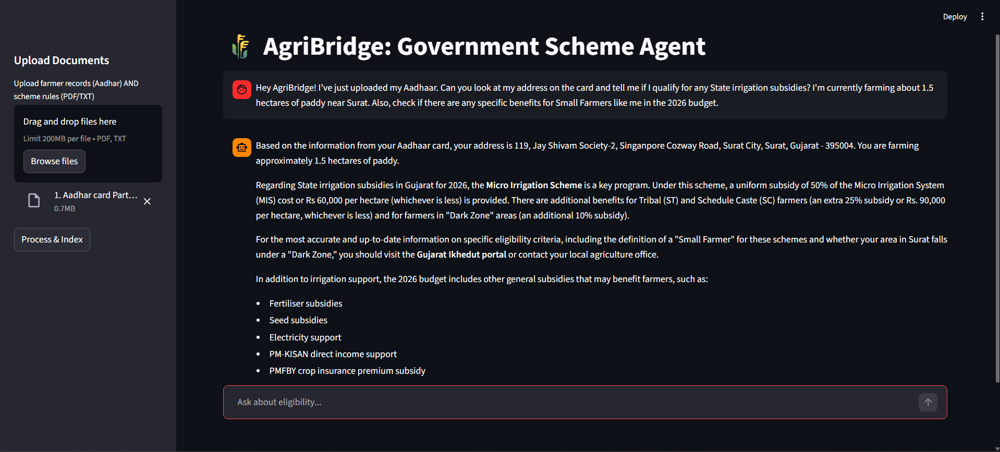

<h1 align="center">🌾 AgriBridge AI — Multilingual Agricultural Assistant</h1>

<p align="center">
  <em>An AI-powered multilingual chatbot that helps Indian farmers discover government schemes, subsidies, and agricultural benefits personalized to their state and profile.</em>
</p>

<p align="center">
  
  
  
  
  
  
</p>

---

## 📌 Problem Statement

Millions of Indian farmers miss out on government schemes and subsidies due to:
- **Language barriers** — Most platforms are English-only
- **Complex eligibility rules** — Difficult to understand bureaucratic criteria
- **Lack of awareness** — Farmers don't know which state/central schemes apply to them

**AgriBridge AI** solves this by providing a voice-enabled, multilingual AI assistant that automatically identifies a farmer's state from uploaded documents (like Aadhaar) and recommends relevant schemes in their preferred language.

---

## ✨ Key Features

| Feature | Description |
|---------|-------------|
| 🌍 **8 Indian Languages** | English, Hindi, Tamil, Telugu, Gujarati, Bengali, Malayalam, Marathi |
| 🎤 **Voice Input & Output** | Speak queries and hear responses via Speech-to-Text & Text-to-Speech |
| 📄 **Document Intelligence** | Upload Aadhaar/land records → AI extracts name, state, address automatically |
| 🔍 **Smart Scheme Search** | Searches government schemes based on user's state using Tavily API |
| 🧠 **RAG Pipeline** | Retrieval-Augmented Generation using ChromaDB vector store + Gemini LLM |
| 🤖 **Agentic Architecture** | LangChain agent with 3 specialized tools for intelligent decision-making |

---

## 🏗️ Architecture

```
┌─────────────────────────────────────────────────┐
│                  Streamlit UI                    │
│         (Voice Input + Chat Interface)           │
└──────────────────────┬──────────────────────────┘
                       │
                       ▼
┌──────────────────────────────────────────────────┐
│              LangChain Agent (Gemini 2.5 Flash)  │
│                                                  │
│  ┌──────────────┐ ┌────────────┐ ┌────────────┐  │
│  │  Document    │ │   User     │ │  Smart Web  │  │
│  │  Lookup      │ │  Profile   │ │  Search     │  │
│  │  (ChromaDB)  │ │ Extractor  │ │  (Tavily)   │  │
│  └──────────────┘ └────────────┘ └────────────┘  │
└──────────────────────────────────────────────────┘
                       │
          ┌────────────┼────────────┐
          ▼            ▼            ▼
   ┌───────────┐ ┌──────────┐ ┌──────────┐
   │ ChromaDB  │ │ Gemini   │ │ Tavily   │
   │ Vector DB │ │ API      │ │ Search   │
   └───────────┘ └──────────┘ └──────────┘
```

---

## 🛠️ Tech Stack

| Layer | Technology |
|-------|-----------|
| **Frontend** | Streamlit |
| **LLM** | Google Gemini 2.5 Flash |
| **Agent Framework** | LangChain + LangGraph |
| **Vector Store** | ChromaDB |
| **Embeddings** | HuggingFace `all-MiniLM-L6-v2` |
| **Web Search** | Tavily Search API |
| **Speech-to-Text** | Google Speech Recognition |
| **Text-to-Speech** | gTTS (Google Text-to-Speech) |
| **Document Parsing** | PyPDF |

---

## 🚀 Getting Started

### Prerequisites

- Python 3.10+
- [FFmpeg](https://ffmpeg.org/download.html) (required for audio processing)

### 1. Clone the Repository

```bash
git clone https://github.com/<your-username>/AgriBridge-AI.git
cd AgriBridge-AI
```

### 2. Create Virtual Environment

```bash
python -m venv .venv

# Windows
.venv\Scripts\activate

# macOS/Linux
source .venv/bin/activate
```

### 3. Install Dependencies

```bash
pip install -r requirements.txt
```

### 4. Set Up Environment Variables

Create a `.env` file in the project root:

```env
GOOGLE_API_KEY=your_google_gemini_api_key
TAVILY_API_KEY=your_tavily_api_key
```

> 🔑 Get your API keys:
> - **Gemini API Key**: [Google AI Studio](https://aistudio.google.com/app/apikey)
> - **Tavily API Key**: [Tavily](https://tavily.com/)

### 5. Run the Application

```bash
streamlit run app.py
```

The app will open at `http://localhost:8501`

---

## 📖 How It Works

1. **Upload Documents** — Upload your Aadhaar card or land records via the sidebar
2. **Document Processing** — The system extracts your personal info (name, state, address) using Gemini and indexes the content into ChromaDB
3. **Ask Questions** — Type or speak your query in any of the 8 supported languages
4. **Agent Reasoning** — The LangChain agent:
   - Calls `get_user_profile` to identify your state
   - Uses `document_lookup` to search your uploaded documents
   - Uses `smart_web_search` to find state-specific government schemes
5. **Multilingual Response** — Get answers in your preferred language with voice output

---

## 📂 Project Structure

```
AgriBridge-AI/
├── app.py                  # Main Streamlit application
├── src/
│   ├── __init__.py
│   ├── agent.py            # LangChain agent with 3 tools
│   ├── ingest.py           # Document processing & vector DB creation
│   ├── available_agent.py  # Utility to list available Gemini models
│   └── tools.py            # Additional tools (extensible)
├── data/
│   └── official_schemes.txt  # Pre-loaded scheme rules (PM-KISAN, PMKSY)
├── screenshot/
│   ├── chat.png            # Chat interface screenshot
│   └── structure.png       # Architecture diagram
├── requirements.txt        # Python dependencies
├── LICENSE                 # MIT License
├── .gitignore
└── README.md
```

---

## 📸 Screenshots

<p align="center">
  
  <br/>
  <em>Chat interface showing multilingual conversation with voice support</em>
</p>

---

## 🌾 Supported Government Schemes

The system currently includes rules for:

- **PM-KISAN** — Direct income support for all landholding farmer families
- **PMKSY (Irrigation Subsidy)** — 100% subsidy on drip/sprinkler for small/marginal farmers

The agent also performs **live web searches** via Tavily to fetch the latest state-specific and central government schemes.

---

## 🔧 Agent Tools

| Tool | Purpose |
|------|---------|
| `document_lookup` | Searches uploaded documents (Aadhaar, land records) using semantic similarity |
| `get_user_profile` | Extracts user's personal details (name, state, address) from indexed documents |
| `smart_web_search` | Performs state-aware web search for latest government schemes via Tavily |

---

## 🤝 Contributing

Contributions are welcome! Feel free to:

1. Fork the repository
2. Create a feature branch (`git checkout -b feature/new-feature`)
3. Commit your changes (`git commit -m 'Add new feature'`)
4. Push to the branch (`git push origin feature/new-feature`)
5. Open a Pull Request

---

## 📄 License

This project is licensed under the **MIT License** — see the [LICENSE](LICENSE) file for details.

---

## 👤 Author

**Kishan Patel** — [@Kishanptl951](https://github.com/kishanptl951)

---

<p align="center">
  Made with ❤️ for Indian Farmers
</p>
